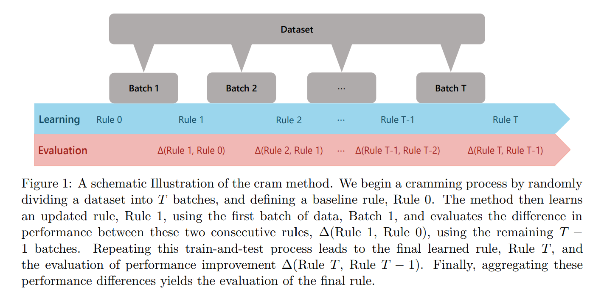
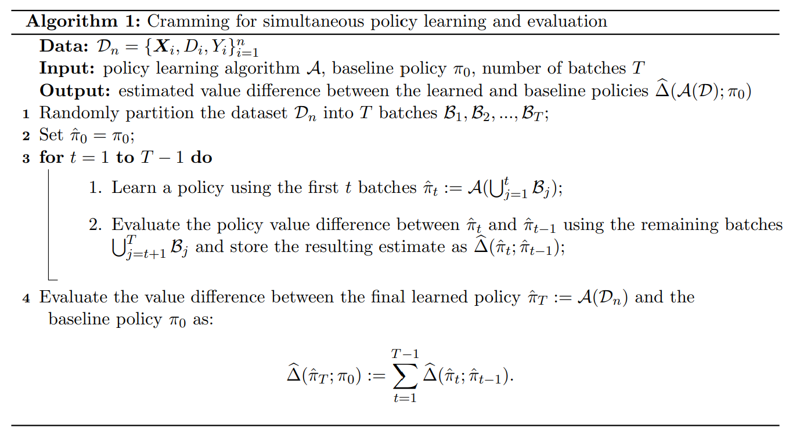
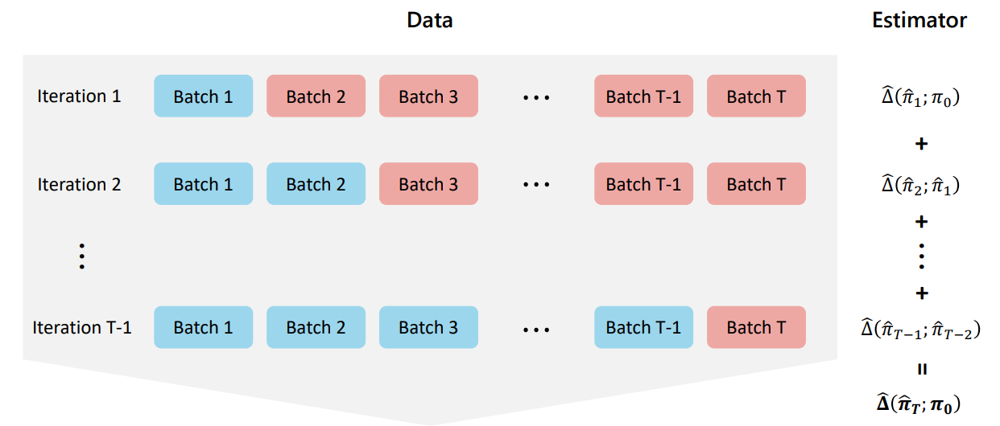

```{r setup, include = FALSE}
knitr::opts_chunk$set(
  collapse = TRUE,
  comment = "#>"
)
library(cramR)
library(DT)
```

## Introduction: What is the Cram Method?

The **Cram method** is a powerful approach for **simultaneously learning and evaluating decision rules**, such as individualized treatment rules (ITRs), from data.

Unlike traditional approaches like **sample splitting** or **cross-validation**, which waste part of the data on evaluation only, **Cram reuses all available data** efficiently.

A key distinction from **cross-validation** is that Cram evaluates the final learned model, rather than averaging performance across multiple models trained on different data splits.


Cram:

- Simultaneously trains a model and evaluates the final learned decision rule using all available data to improve statistical efficiency and precision—unlike cross-validation or sample splitting, which reserve part of the data for evaluation only.

- Learns in cumulative batches, using each new round of data to refine the model and check whether it's actually improving—ensuring that learning translates into meaningful gains.

- Estimates the expected outcome across the population if the learned decision rule were applied to everyone (policy value)

> Think of Cram like a cram school: learn a bit, test a bit, repeat — getting better while constantly self-evaluating.

## The Cram Workflow

Below is the core idea of the Cram method visualized:




This procedure ensures each update is backed by performance testing, enabling **both learning and evaluation in one pass** over the data.




This schematic represents how Cram averages over **many mini train-test steps**, ultimately estimating the improvement of the final learned rule over the baseline. 

Note: this reflects the difference in policy value relative to a baseline, but Cram can also be used to estimate the policy value of the learned rule directly (not presented as part of the introduction but available in the main functions of Cram).

Mathematically, the estimated policy value difference is:

\[
\hat{\Delta}(\pi_T; \pi_0) = \sum_{t=1}^{T-1} \hat{\Delta}(\pi_t, \pi_{t-1})
\]

Where:

- \(\pi_t\) is the policy learned after batch `t`
- Evaluation is done using the *unseen* remaining data

## The `cram_policy()` Function

The `cram_policy()` function in **cramR** implements the Cram framework for binary treatment policy learning.

### 🔑 Key Features of `cram_policy()`

- **Model-Agnostic Flexibility**: Supports a variety of learning strategies, including `causal_forest`, `s_learner`, and `m_learner`, as well as fully customizable learners via user-defined fit and predict functions.

- **Efficient by Design**: Built on top of `data.table` for fast, memory-efficient computation, with optional support for parallel batch training to scale across larger datasets.
 

## Example: Running Cram Policy on simulated data

```{r}
library(data.table)
# Function to generate sample data with heterogeneous treatment effects:
# - Positive effect group
# - Neutral effect group
# - Adverse effect group
generate_data <- function(n) {
  X <- data.table(
    binary = rbinom(n, 1, 0.5),                 # Binary variable
    discrete = sample(1:5, n, replace = TRUE),  # Discrete variable
    continuous = rnorm(n)                       # Continuous variable
  )

  # Binary treatment assignment (50% treated)
  D <- rbinom(n, 1, 0.5)

  # Define heterogeneous treatment effects based on X
  treatment_effect <- ifelse(
    X[, binary] == 1 & X[, discrete] <= 2,        # Group 1: Positive effect
    1,
    ifelse(X[, binary] == 0 & X[, discrete] >= 4, # Group 3: Adverse effect
           -1,
           0.1)                                   # Group 2: Neutral effect
  )

  # Outcome depends on treatment effect + noise
  Y <- D * (treatment_effect + rnorm(n, mean = 0, sd = 1)) +
    (1 - D) * rnorm(n)

  return(list(X = X, D = D, Y = Y))
}

# Generate a sample dataset
set.seed(123)
n <- 1000
data <- generate_data(n)
X <- data$X
D <- data$D
Y <- data$Y

```


```{r}
# Number of batches to split the data into
batch <- 20  

# Model type for estimating treatment effects
# Options: "causal_forest", "s_learner", "m_learner", NULL (to use custom model)
model_type <- "causal_forest"  

# Learner type used inside s/m-learners
# NULL is required for causal_forest; use "ridge" or "fnn" for s/m learners
learner_type <- NULL  

# Baseline policy to compare against (list of 0/1 for each individual)
# Common options:
# - All-control baseline: as.list(rep(0, nrow(X))) or NULL
# - Randomized baseline: as.list(sample(c(0, 1), nrow(X), replace = TRUE))
baseline_policy <- as.list(rep(0, nrow(X)))  

# Whether to parallelize across batches (TRUE for faster but memory-heavy runs)
parallelize_batch <- FALSE  
 

# Model-specific parameters (MORE DETAILS IN THE ARTICLE "QUICK START")
# Examples:
# - causal_forest: list(num.trees = 100)
# - ridge: list(alpha = 1)
# - fnn (Feedforward Neural Network): see below
model_params <- NULL  

# Advanced example for fnn (not used here):
# default_model_params <- list(
#   input_layer = list(units = 64, activation = 'relu', input_shape = input_shape),
#   layers = list(list(units = 32, activation = 'relu')),
#   output_layer = list(units = 1, activation = 'linear'),
#   compile_args = list(optimizer = 'adam', loss = 'mse'),
#   fit_params = list(epochs = 5, batch_size = 32, verbose = 0)
# )

# Significance level for confidence intervals (default = 95%)
alpha <- 0.05  

# Run the Cram policy method
result <- cram_policy(
  X, D, Y,
  batch = batch,
  model_type = model_type,
  learner_type = learner_type,
  baseline_policy = baseline_policy,
  parallelize_batch = parallelize_batch,
  model_params = model_params,
  alpha = alpha
)

# Display the results
print(result)

```

## Interpreting Results

```{r}
result$raw_results
```

```{r}
result$interactive_table
```


The output of `cram_policy()` includes:

- **`raw_results`**: A data frame summarizing key evaluation metrics:

  - **`Delta Estimate`**: The estimated improvement in outcomes from using the final learned policy compared to a baseline (e.g., no treatment or treat-all).  
  - **`Delta Standard Error`** and **confidence interval bounds**: Reflect the uncertainty around the delta estimate.  
  - **`Policy Value Estimate`**: The estimated average outcome if the final learned policy were applied across the population.  
  - **`Policy Value Standard Error`** and **confidence interval bounds**: Reflect uncertainty in the policy value estimate.  
  - **`Proportion Treated`**: The fraction of the population that would be treated under the learned policy.

- **`interactive_table`**: A dynamic, scrollable version of `raw_results` for easier exploration and filtering.

- **`final_policy_model`**: The trained policy model object itself, fitted according to the specified `model_type`, `learner_type`, or user-provided `custom_fit` and `custom_predict` (more details in the article "Quick Start"). This object can be used for further analysis or for applying the learned policy to new data.

```{r}
class(result$final_policy_model)
summary(result$final_policy_model)

```

You can inspect or apply the learned model to new data.

## Visual Summary and Notes




This visualization summarizes how multiple evaluations across iterations contribute to the full Cram estimate.

Notes:

- **Batching**: You can pass a number (e.g., `batch = 5`) or a custom vector to control how data is split.  
- **Parallelization**: Enable with `parallelize_batch = TRUE`.  
- **Custom Learners**: Use `custom_fit` and `custom_predict` to plug in any estimator. (more details in the article "Quick Start")

## Why Cram?

Compared to classic evaluation methods:

| Method            | Learning | Evaluation        | Data Use         |
|-------------------|----------|-------------------|------------------|
| Sample Splitting  | Partial  | Partial           | ❌ Inefficient    |
| Cross-Validation  | Partial  | Average performance over different models | ⚠️ Partial for each model  |
| **Cram**          | ✅ Full  | ✅ Final model evaluated directly | ✅ Fully reused for both learning and evaluation |


## References

- Jia, Z., Imai, K., & Li, M. L. (2024). *The Cram Method for Efficient Simultaneous Learning and Evaluation*. arXiv:2403.07031.  
- Künzel, S. R., Sekhon, J. S., Bickel, P. J., & Yu, B. (2019). Metalearners for estimating heterogeneous treatment effects using machine learning. Proceedings of the National Academy of Sciences of the United States of America, 116(10), 4156–4165. https://doi.org/10.1073/pnas.1804597116
- Wager, S., & Athey, S. (2018). Estimation and inference of heterogeneous treatment effects using random forests. Journal of the American Statistical Association, 113(523), 1228-1242. 
- Athey, S., & Imbens, G. (2016). Recursive partitioning for heterogeneous causal effects. Proceedings of the National Academy of Sciences, 113(27), 7353-7360.
